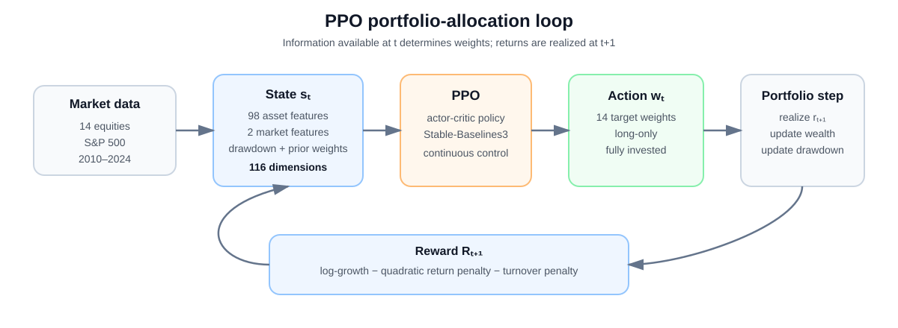
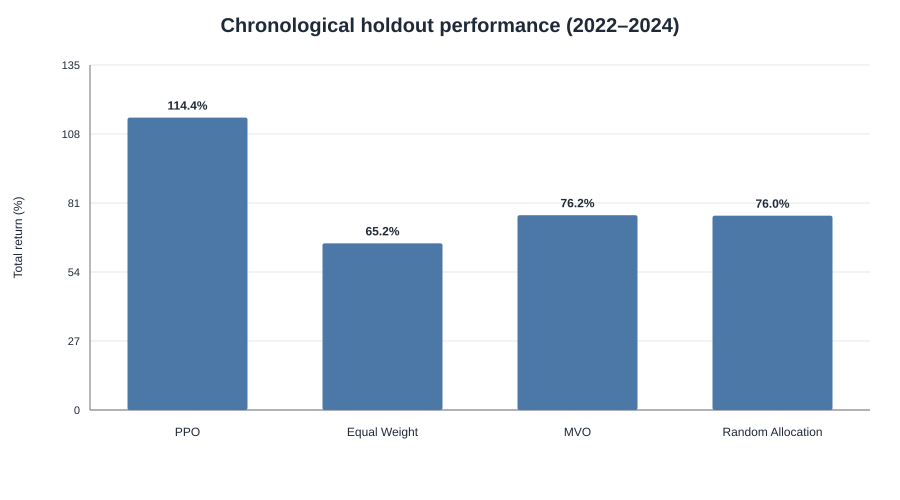
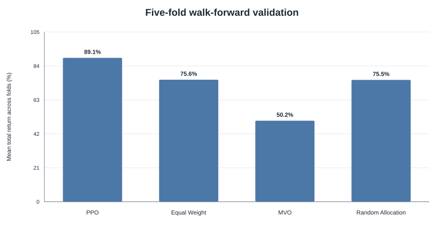
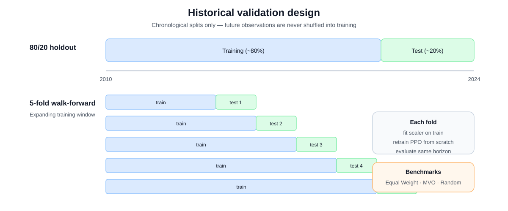

# Deep Reinforcement Learning for Dynamic Portfolio Allocation

A research implementation of **Proximal Policy Optimization (PPO)** for dynamic allocation across a 14-asset equity portfolio. The agent observes market, technical, and portfolio-state information and chooses long-only target weights at each trading day.

[](https://github.com/Pimvdbos/reinforcement-learning/actions/workflows/ci.yml)

| | Project at a glance |
|---|---|
| **Problem** | Continuous-control portfolio allocation |
| **RL algorithm** | Proximal Policy Optimization (PPO) |
| **Universe** | 14 equities + S&P 500 market features |
| **State** | 116 dimensions |
| **Action** | 14 long-only target weights |
| **Validation** | Chronological holdout + 5-fold walk-forward |
| **Benchmarks** | Equal Weight, MVO, Random Allocation |
| **Explainability** | SHAP-based policy sensitivity analysis |
| **Stack** | Python, PyTorch, Stable-Baselines3, Gymnasium |

The project asks whether a learned policy can adapt portfolio weights to changing market states and whether that behavior generalizes beyond a single historical split.

---

## System design



At each decision date, information available at time **t** is converted into a state vector. PPO maps that state to target portfolio weights, after which the return at **t+1** is realized. The next observation therefore depends on the new portfolio state and updated market information.

**Core implementation:** [`PortfolioEnv`](src/rl_portfolio/environment.py) · [`PPO agent`](src/rl_portfolio/agent.py) · [`features`](src/rl_portfolio/features.py) · [`benchmarks`](src/rl_portfolio/benchmarks.py) · [`holdout experiment`](scripts/train_holdout.py) · [`walk-forward validation`](scripts/cross_validate.py) · [`research notebook`](notebooks/portfolio_rl_walkthrough.ipynb)

---

## Key results

### Chronological holdout: 2022–2024

The principal experiment used an 80/20 chronological split over the aligned 2010–2024 sample. PPO achieved the highest total return and Sharpe ratio in the holdout period, although it did not produce the smallest drawdown.

| Strategy | Total return | Annualized return | Sharpe | Max drawdown |
|---|---:|---:|---:|---:|
| **PPO** | **114.38%** | **30.30%** | **1.21** | -25.89% |
| Equal Weight | 65.23% | 19.01% | 0.88 | -22.80% |
| MVO | 76.20% | 21.70% | 0.85 | -29.19% |
| Random Allocation | 76.02% | 21.65% | 0.97 | **-20.39%** |



### Five-fold walk-forward validation

The broader validation produces a more balanced picture. PPO generated the **highest mean total return**, while Equal Weight achieved the **highest mean Sharpe ratio** and slightly smaller average drawdown.

| Strategy | Mean total return | Mean annualized return | Mean Sharpe | Mean max drawdown |
|---|---:|---:|---:|---:|
| **PPO** | **89.11%** | **29.71%** | 1.25 | -19.86% |
| Equal Weight | 75.57% | 26.02% | **1.30** | **-18.59%** |
| MVO | 50.21% | 17.97% | 0.84 | -22.97% |
| Random Allocation | 75.47% | 25.94% | 1.22 | -18.81% |



### Interpretation

The strongest conclusion is **not** that PPO dominates every benchmark on every metric. The evidence supports a narrower result:

> PPO learned a state-dependent allocation policy that produced higher cumulative growth across several historical regimes, while its risk-adjusted advantage was not uniform across validation folds.

The holdout and walk-forward tables above are archived outputs from the final experiment. Historical wealth curves are **gross of realized transaction costs**: turnover costs entered the PPO reward but were not deducted from reported wealth. The refactored implementation also supports economically stricter net-cost accounting for new runs.

---

## Portfolio MDP

### Observation space

The default observation contains **116 variables**:

| Component | Dimensions |
|---|---:|
| Seven asset features × 14 equities | 98 |
| S&P 500 market features | 2 |
| Current portfolio drawdown | 1 |
| Previous asset weights | 14 |
| Cash compatibility state | 1 |
| **Total** | **116** |

Each asset contributes seven features:

- 1-day log return
- 5-day log return
- 20-day realized volatility
- 20-day momentum
- RSI-14
- Bollinger Band width
- Bollinger Band position

The market-level inputs are the S&P 500 daily log return and 20-day rolling volatility. `RobustScaler` is fitted **only on the training sample** within each chronological split.

### Action space

PPO produces 14 continuous action components. The environment converts them to a long-only, fully invested portfolio:

```text
w[t,i] = max(a[t,i], 0) / Σ_j max(a[t,j], 0)
```

If every raw action component is zero, the environment falls back to equal weighting.

### Reward

The historical experiment used:

```text
R[t+1] = log(1 + r_p[t+1])
         - λ_r × (r_p[t+1])²
         - c_tr × ||w_t - w_(t-1)||₁
```

where:

- `r_p[t+1]` is the realized next-period portfolio return,
- `λ_r` controls the quadratic return penalty,
- `c_tr` penalizes portfolio turnover.

The selected values were `λ_r = 0.1344558` and `c_tr = 0.001`.

The squared-return term is treated as a **one-period risk regularizer**, not as portfolio variance.

---

## PPO configuration

The policy is implemented with Stable-Baselines3 `PPO("MlpPolicy")`. The actor produces a continuous stochastic action and the critic estimates the state value used in advantage estimation.

| Hyperparameter | Value |
|---|---:|
| Learning rate | `8.2749e-05` |
| Rollout steps | `512` |
| Batch size | `32` |
| Discount factor γ | `0.98965` |
| GAE λ | `0.95018` |
| Entropy coefficient | `0.11275` |
| Risk-aversion coefficient | `0.13446` |
| Training timesteps | `200,000` |
| Seed | `1986` |

The final settings are preserved from the original experiment. The historical Optuna search notebook is no longer available, so the repository deliberately does **not** claim to reproduce the original hyperparameter search.

---

## Validation design



### Holdout experiment

Adjusted daily prices cover 2010–2024. The first 80% of the aligned observations form the training period and the final 20% form the out-of-sample evaluation period. Observations are never shuffled.

### Walk-forward validation

Five expanding-window folds are generated with `TimeSeriesSplit`. In every fold:

1. preprocessing is fitted on the training window only;
2. PPO is trained from scratch;
3. MVO is estimated using training information only;
4. every strategy is evaluated on the same subsequent horizon.

### Synthetic-market sanity check

The complete pipeline is also tested on a 14-asset geometric Ornstein-Uhlenbeck market with controlled mean reversion and correlated shocks. This is used as an **implementation sanity check**, not as evidence of real-market profitability.

### Benchmarks

- **Equal Weight** — transparent, parameter-free diversification.
- **Mean-Variance Optimization (MVO)** — long-only maximum-Sharpe allocation estimated from the training period.
- **Random Allocation** — daily Dirichlet weights used as an uninformed diagnostic control.

---

## Policy explainability

The project includes SHAP-based analysis of PPO's action outputs. The goal is to inspect **policy sensitivity**: which state variables are associated with changes in target portfolio weights.

The explainability pipeline is implemented in [`scripts/explain_policy.py`](scripts/explain_policy.py) and [`src/rl_portfolio/explainability.py`](src/rl_portfolio/explainability.py).

SHAP values are interpreted as explanations of the learned policy, **not** as causal evidence that a feature predicts future returns.

---

## Implementation safeguards

The refactored codebase adds explicit safeguards around the parts of financial RL most prone to silent errors:

- **Explicit asset ordering** from data download through returns, actions, stored weights, and SHAP targets.
- **Strict t → t+1 timing** so the next realized return cannot enter the current decision state.
- **Train-only preprocessing** in every holdout and walk-forward split.
- **Matched evaluation horizons** across PPO and all benchmarks.
- **Isolated experiment scripts** instead of notebook-global state.
- **Two transaction-cost modes:** historical `reward_only` and stricter `net` wealth accounting.
- **Automated tests** covering action normalization, temporal alignment, feature dimensions, asset ordering, cost accounting, metrics, and explainability mapping.

The current GitHub Actions workflow runs the test suite automatically on pushes and pull requests.

Detailed design decisions are documented in [`docs/methodology.md`](docs/methodology.md) and [`docs/reproducibility.md`](docs/reproducibility.md).

---

## Repository structure

```text
reinforcement-learning/
├── src/rl_portfolio/
│   ├── environment.py         # Gymnasium portfolio MDP
│   ├── agent.py               # Stable-Baselines3 PPO construction
│   ├── features.py            # State feature engineering
│   ├── benchmarks.py          # EW, MVO and random allocation
│   ├── evaluation.py          # Portfolio performance metrics
│   ├── explainability.py      # SHAP helpers
│   ├── synthetic.py           # Synthetic OU market
│   └── ...
├── scripts/
│   ├── train_holdout.py
│   ├── cross_validate.py
│   ├── synthetic_validation.py
│   ├── risk_aversion_sweep.py
│   └── explain_policy.py
├── notebooks/
│   └── portfolio_rl_walkthrough.ipynb
├── results/                   # Archived experiment metrics
├── figures/                   # Architecture and result visualizations
├── docs/                      # Methodology and reproducibility notes
├── tests/                     # Automated tests
├── pyproject.toml
└── requirements.txt
```

---

## Reproduction

Create a virtual environment and install the project:

```bash
python -m venv .venv

# Windows
.venv\Scripts\activate

# macOS / Linux
source .venv/bin/activate

pip install -r requirements.txt
```

Run the main historical holdout experiment:

```bash
python scripts/train_holdout.py --timesteps 200000
```

Run five-fold walk-forward validation:

```bash
python scripts/cross_validate.py --timesteps 200000
```

Run the synthetic-market validation:

```bash
python scripts/synthetic_validation.py --timesteps 200000
```

For a lighter implementation check:

```bash
python scripts/train_holdout.py --timesteps 10000
```

To deduct the turnover-cost proxy from portfolio wealth:

```bash
python scripts/train_holdout.py --cost-accounting net
```

Run the automated tests:

```bash
pytest -q
```

Full PPO experiments are computationally expensive, and exact results can vary with stochastic optimization, library versions, hardware, and market-data revisions. The historical experiment outputs are therefore archived in [`results/`](results/).

---

## Limitations

This is a research implementation, not a deployable trading strategy. Important limitations include:

- a hand-selected 14-stock universe and associated selection/survivorship bias;
- a relatively short final holdout period;
- one principal training seed in the historical experiment;
- no reproducible record of the original Optuna search;
- simplified turnover costs;
- no explicit market-impact, liquidity, borrowing, or execution model;
- post-hoc policy explainability rather than causal inference.

Historical outperformance should therefore not be interpreted as evidence of persistent future alpha.

---

## Technology

`Python` · `PyTorch` · `Stable-Baselines3` · `Gymnasium` · `PPO` · `actor-critic methods` · `Markov Decision Processes` · `pandas` · `scikit-learn` · `PyPortfolioOpt` · `walk-forward validation` · `SHAP`

## Project context

Developed for the University of Twente Reinforcement Learning course (2025–2026) and individually assessed. This repository is a privacy-cleaned, modular implementation focused on reproducibility and methodological clarity.
