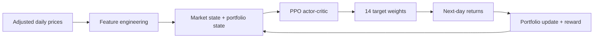

# Deep Reinforcement Learning for Dynamic Portfolio Allocation

A research implementation of **Proximal Policy Optimization (PPO)** for dynamic allocation across a 14-asset equity portfolio. The problem is formulated as a continuous-control Markov Decision Process in which the policy observes market, technical, and portfolio-state information and selects long-only target weights at each trading day.

The project focuses on three questions:

1. Can PPO learn a state-dependent allocation policy from noisy financial time series?
2. Does that policy generalize beyond a single train/test split?
3. How does it compare with equal weighting, mean-variance optimization, and uninformed random allocation?

The repository contains a modular Gymnasium environment, Stable-Baselines3 PPO training pipeline, walk-forward validation, synthetic-market validation, classical benchmarks, portfolio accounting, SHAP-based policy explainability, tests, and archived experiment outputs.



**Core implementation:** [`PortfolioEnv`](src/rl_portfolio/environment.py) · [`PPO agent`](src/rl_portfolio/agent.py) · [`features`](src/rl_portfolio/features.py) · [`benchmarks`](src/rl_portfolio/benchmarks.py) · [`holdout experiment`](scripts/train_holdout.py) · [`walk-forward validation`](scripts/cross_validate.py) · [`research notebook`](notebooks/portfolio_rl_walkthrough.ipynb)

---

## Key results

### Chronological holdout: 2022–2024

The principal historical experiment used an 80/20 chronological split over the 2010–2024 sample. PPO achieved the strongest cumulative and risk-adjusted performance among the evaluated strategies.

| Strategy | Total return | Annualized return | Sharpe | Max drawdown |
|---|---:|---:|---:|---:|
| **PPO** | **114.38%** | **30.30%** | **1.21** | -25.89% |
| Equal Weight | 65.23% | 19.01% | 0.88 | -22.80% |
| MVO | 76.20% | 21.70% | 0.85 | -29.19% |
| Random Allocation | 76.02% | 21.65% | 0.97 | **-20.39%** |


### Five-fold walk-forward validation

The broader validation gives a more balanced result. PPO generated the **highest mean total return**, while Equal Weight achieved a slightly higher average Sharpe ratio and lower average drawdown.

| Strategy | Mean total return | Mean annualized return | Mean Sharpe | Mean max drawdown |
|---|---:|---:|---:|---:|
| **PPO** | **89.11%** | **29.71%** | 1.25 | -19.86% |
| Equal Weight | 75.57% | 26.02% | **1.30** | **-18.59%** |
| MVO | 50.21% | 17.97% | 0.84 | -22.97% |
| Random Allocation | 75.47% | 25.94% | 1.22 | -18.81% |


The central empirical takeaway is therefore **not** that PPO dominates passive allocation on every metric. The stronger conclusion is that PPO learned a dynamic, state-dependent policy that produced higher cumulative growth in several historical regimes, with a corresponding increase in downside variability relative to simpler diversification rules.

> **Result provenance:** the numerical tables are archived outputs from the final university experiment; the two SVG figures are regenerated directly from those archived metrics. The historical results are gross of realized transaction costs: turnover costs influenced PPO's reward but were not deducted from reported wealth. The refactored implementation also supports consistent net-cost accounting for new runs.

---

## Portfolio MDP

At decision date \(t\), the agent observes a state \(s_t\), selects target portfolio weights \(w_t\), and receives the realized asset-return vector at \(t+1\) only after the action has been chosen.

### Observation space

The default observation has **116 dimensions**:

| Component | Dimensions |
|---|---:|
| Seven asset features × 14 equities | 98 |
| S&P 500 market features | 2 |
| Portfolio drawdown | 1 |
| Previous asset weights | 14 |
| Cash compatibility state | 1 |
| **Total** | **116** |

Per-asset features are:

- 1-day log return
- 5-day log return
- 20-day realized volatility
- 20-day momentum
- RSI-14
- Bollinger Band width
- Bollinger Band position

The two market-level inputs are the S&P 500 daily log return and 20-day rolling volatility. `RobustScaler` is fitted only on the relevant training sample in every chronological split.

### Action space

PPO produces 14 continuous action components. The environment maps these to a long-only, fully invested simplex:

\[
w_{t,i} = \frac{\max(a_{t,i},0)}{\sum_j \max(a_{t,j},0)}.
\]

The implementation defensively falls back to equal weighting if every raw action component is zero.

### Reward

The historical experiment used

\[
R_{t+1}
= \log(1+r_{p,t+1})
- \lambda_r r_{p,t+1}^{2}
- c_{\mathrm{tr}}\lVert w_t-w_{t-1}\rVert_1,
\]

with \(\lambda_r = 0.1344558\) and \(c_{\mathrm{tr}} = 0.001\).

The reward combines compound portfolio growth with a quadratic one-period return penalty and an L1 turnover penalty. The squared-return term is deliberately interpreted as a **risk regularizer**, not as portfolio variance.

---

## PPO architecture

The policy is implemented with Stable-Baselines3 `PPO("MlpPolicy")`. The actor and critic use the library's default separate multilayer perceptrons; the policy outputs a continuous stochastic action distribution and the critic estimates the state value used in advantage estimation.

Final experiment configuration:

| Hyperparameter | Value |
|---|---:|
| Learning rate | `8.2749e-05` |
| Rollout steps | `512` |
| Batch size | `32` |
| Discount factor \(\gamma\) | `0.98965` |
| GAE \(\lambda\) | `0.95018` |
| Entropy coefficient | `0.11275` |
| Risk-aversion coefficient | `0.13446` |
| Training timesteps | `200,000` |
| Seed | `1986` |

The final hyperparameters are preserved from the original experiment. The historical Optuna search notebook is no longer available, so this repository does not claim to reproduce the original Bayesian search process.

---

## Experimental design

### Synthetic-market validation

The full pipeline is first tested on a 14-asset geometric Ornstein-Uhlenbeck market with controlled mean reversion and correlated shocks. This serves as a **sanity check of the RL pipeline**, not evidence of real-world profitability.

### Real-market holdout

Adjusted daily prices cover 2010–2024. The first 80% of the aligned sample is used for training and the final 20% for evaluation. No observations are shuffled.

### Walk-forward validation

Five expanding-window folds are generated with `TimeSeriesSplit`. For each fold:

1. the scaler is fitted only on the training window;
2. a new PPO agent is trained from scratch;
3. MVO is estimated using training prices only;
4. all strategies are evaluated on the same subsequent test horizon.

### Benchmarks

- **Equal Weight** — transparent, parameter-free diversification.
- **Mean-Variance Optimization** — long-only maximum-Sharpe portfolio estimated from training prices only.
- **Random Allocation** — daily Dirichlet target weights used as an uninformed diagnostic control.

---

## Implementation safeguards

The public implementation separates research logic into explicit modules and adds safeguards around the areas that matter most in financial RL:

- **Explicit ticker ordering** from data download through actions, weights, and SHAP targets.
- **Strict \(t \rightarrow t+1\) timing** so next-day returns cannot enter the current decision state.
- **Train-only preprocessing** for every holdout or walk-forward split.
- **Matched evaluation horizons** for PPO and all benchmarks.
- **Isolated experiment scripts** instead of notebook-global state.
- **Two cost-accounting modes:** historical `reward_only` and economically stricter `net` wealth accounting.
- **Unit tests** for action normalization, temporal alignment, feature dimensionality, asset ordering, cost accounting, metrics, and explainability mapping.

The detailed methodological audit is documented in [`docs/methodology.md`](docs/methodology.md) and [`docs/reproducibility.md`](docs/reproducibility.md).

---

## Repository structure

```text
reinforcement-learning/
├── src/rl_portfolio/              # Reusable RL, portfolio and data modules
│   ├── environment.py             # Gymnasium portfolio MDP
│   ├── agent.py                   # Stable-Baselines3 PPO construction
│   ├── features.py                # 101-feature state engineering
│   ├── benchmarks.py              # EW, MVO and random allocation
│   ├── evaluation.py              # Performance metrics
│   ├── explainability.py          # SHAP policy helpers
│   ├── synthetic.py               # OU synthetic market
│   └── ...
├── scripts/                       # Reproducible experiment entry points
│   ├── train_holdout.py
│   ├── cross_validate.py
│   ├── synthetic_validation.py
│   ├── risk_aversion_sweep.py
│   └── explain_policy.py
├── notebooks/
│   └── portfolio_rl_walkthrough.ipynb
├── results/                       # Archived historical experiment metrics
├── figures/                       # Main result visualizations
├── docs/                          # Methodology and reproducibility notes
├── tests/                         # Portfolio and RL pipeline tests
├── pyproject.toml
└── requirements.txt
```

---

## Reproduce the project

```bash
python -m venv .venv

# Windows
.venv\Scripts\activate

# macOS / Linux
source .venv/bin/activate

pip install -r requirements.txt
```

Run the chronological holdout experiment:

```bash
python scripts/train_holdout.py --timesteps 200000
```

Run five-fold walk-forward validation:

```bash
python scripts/cross_validate.py --timesteps 200000
```

Run the synthetic-market validation:

```bash
python scripts/synthetic_validation.py --timesteps 200000
```

For a quick implementation check rather than a full experiment:

```bash
python scripts/train_holdout.py --timesteps 10000
```

To deduct the turnover-cost proxy from realized wealth as well as the reward:

```bash
python scripts/train_holdout.py --cost-accounting net
```

Full PPO experiments are computationally expensive and results can vary with hardware, library versions, market-data revisions, and stochastic optimization. Exact historical outputs are therefore archived separately in `results/`.

---

## Limitations

The project is an academic research study, not a deployable trading strategy. Important limitations include the hand-selected 14-stock universe, selection and survivorship bias, a relatively short final holdout period, one principal training seed in the historical experiment, no nested time-series hyperparameter tuning in the public reproduction, a simplified turnover-cost model, and no market-impact or liquidity model.

SHAP explanations should be interpreted as **policy sensitivity**, not causal evidence that an indicator predicts future returns. Likewise, the synthetic OU experiment validates implementation behavior under controlled structure; it does not validate investment performance in real markets.

---

## Technology

`Python` · `PyTorch` · `Stable-Baselines3` · `Gymnasium` · `Proximal Policy Optimization` · `actor-critic methods` · `Markov Decision Processes` · `pandas` · `scikit-learn` · `PyPortfolioOpt` · `walk-forward validation` · `SHAP`

## Background

Developed for the University of Twente Reinforcement Learning course (2025–2026) and individually assessed. This repository is a privacy-cleaned, modular research implementation focused on reproducibility and methodological clarity.
